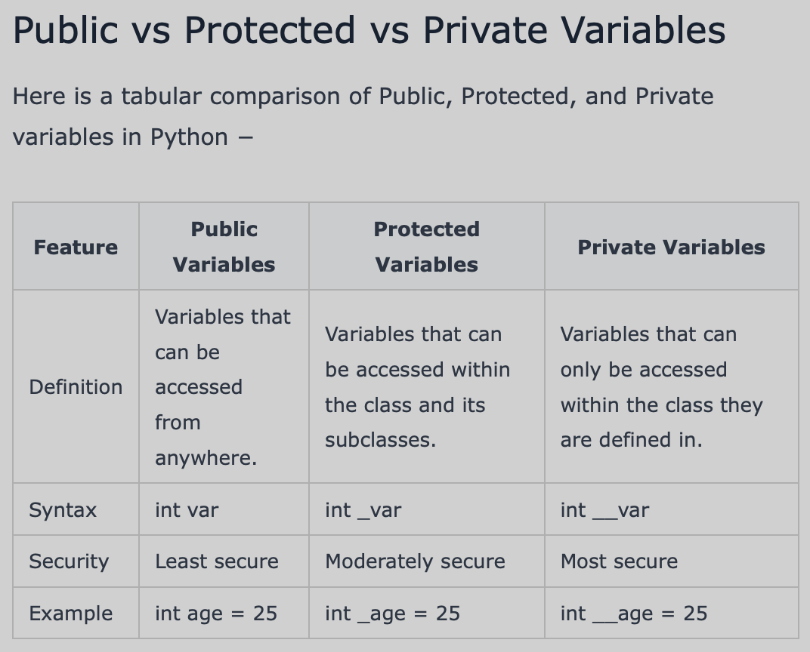

# Python Crash Course:

## Basics:

Covers running Python (interactive vs script mode), naming rules for identifiers, indentation-based blocks, and ways to write multi-line/multi-statement lines.

1. [Basics](./basics/hello-world.py)
2. [Python Identifiers](./basics/python-identifiers.py)
3. [Raw Input](./basics/raw-input.py_bkp)
4. [Multi line statements](./basics/multi-line-statements.py)

<details>
<summary>References</summary>

```py

# Interactive mode:
    $ python3
    >>> print("Hello World")

# Script mode:
    $ python3 hello-world.py
    # or, with a shebang line (#!/usr/bin/python3) + execute permission:
    $ chmod +x hello-world.py && ./hello-world.py

# Multiple statements on one line, separated by ;
    import sys; x = 'foo'; sys.stdout.write(x + '\n')

# Line continuation with \ (no braces in Python — indentation defines blocks)
    total = "1" + \
        "2" + \
        "3"

# Identifier naming rules:
    - starts with a letter or underscore, not a digit
    - only letters, digits, underscores (A-z, 0-9, _)
    - case-sensitive; can't be a reserved keyword
    - _private        -> convention for "private"
    - __strongly_private -> name-mangled inside classes
    - __dunder__      -> language-defined special names

# raw_input() was Python 2 only; Python 3 uses input()
    name = input("Press the enter key to exit.")

```

</details>

## Variables:

Python variables are the reserved memory locations used to store values with in a Python Program. This means that when you create a variable you reserve some space in the memory.

Based on the data type of a variable, memory space is allocated to it. Therefore, by assigning different data types to Python variables, you can store integers, decimals or characters in these variables

1. [Intro](./variables/intro.py)
2. [Area_Perimeter](./variables/area_perimeter.py)
3. [Scopes](./variables/scope.py)
4. [public, private, protected variables](./variables/publi_private_protected_variables.py)
5. [Primitive Data types](./variables/data_types.py)
6. [Dictionaries & Sets](./variables/dictionaries_sets.py)
7. [Memory View Use cases](./variables/memory_view_uses.py)
8. [Boolean & None Type](./variables/boolean.py)

<details>
<summary>References</summary>



| Sr.No. | Function & Description |
|--------|--------------------------|
| 1 | **`int()`** — Converts x to an integer. `base` specifies the base if x is a string. |
| 2 | **`long()`** — Converts x to a long integer. `base` specifies the base if x is a string. This function has been deprecated. |
| 3 | **`float()`** — Converts x to a floating-point number. |
| 4 | **`complex()`** — Creates a complex number. |
| 5 | **`str()`** — Converts object x to a string representation. |
| 6 | **`repr()`** — Converts object x to an expression string. |
| 7 | **`eval()`** — Evaluates a string and returns an object. |
| 8 | **`tuple()`** — Converts s to a tuple. |
| 9 | **`list()`** — Converts s to a list. |
| 10 | **`set()`** — Converts s to a set. |
| 11 | **`dict()`** — Creates a dictionary. d must be a sequence of (key,value) tuples. |
| 12 | **`frozenset()`** — Converts s to a frozen set. |
| 13 | **`chr()`** — Converts an integer to a character. |
| 14 | **`unichr()`** — Converts an integer to a Unicode character. |
| 15 | **`ord()`** — Converts a single character to its integer value. |
| 16 | **`hex()`** — Converts an integer to a hexadecimal string. |
| 17 | **`oct()`** — Converts an integer to an octal string. |

</details>

## Operators:

Covers Python's operator categories — arithmetic, logical, bitwise, comparison, identity (`is`), membership (`in`), and the ternary conditional expression.

1. [Arithmetic](./operators/arithmetic.py)
2. [Logical](./operators/logical.py)
3. [Bitwise](./operators/bitwise.py)
4. [Comparison](./operators/comparison.py)
5. [Identity](./operators/identity_ops.py)
6. [Membership Operators](./operators/membership_operators.py)
7. [Ternary Operators](./operators/ternary_operator.py)

<details>
<summary>References</summary>

```py

# Arithmetic:
    +, -, *, /, //, **, %

# Logical:
    and, or, not

# Bitwise:
    &, |, ~, ^, <<, >>

# Comparison:
    ==, !=, >, >=, <, <=

# Identity:
    is, is not

# Membership Operators:
    in, not in

# Ternary operators:
    <statement> if <condition> else <other_statement>
    e.g., `'Drive' if is_green_signal else 'Stop or prepare to Stop'`

```

</details>

## Loops:

1. [For Loops](./loops/for-loops.py)

<details>
<summary>References</summary>

```py

# Looping a list/string:
    for item in iterable:
        ...

# Looping with unpacking (e.g. list of tuples):
    for x, y in points:
        ...

# Looping a dict (keys by default):
    for key in d:            # keys only
    for key in d.keys():     # explicit keys
    for value in d.values(): # explicit values
    for key, value in d.items(): # both, pythonic way

# break: exits the loop immediately
    for n in range(5):
        if n == 3:
            break

# continue: skips to the next iteration
    for i in range(6):
        if i % 2 == 0:
            continue

# for...else: else runs only if the loop completes WITHOUT hitting a break
    for i in range(5):
        if i == 9:
            break
    else:
        print("Target not found")

# Looping by index (when you need the index, not just the value):
    for i in range(len(vals)):
        print(vals[i])

# enumerate(): pairs each item with its index — avoids manual index tracking
    for index, value in enumerate(items):
        ...
    for index, value in enumerate(items, start=1):  # custom start
        ...

# zip(): loops multiple iterables together, pairwise
    for a, b in zip(list1, list2):
        ...

# itertools.chain(): loops multiple iterables back-to-back, as one sequence
    from itertools import chain
    for val in chain(range(1,3), range(4,8,2)):
        ...

```

</details>